# QSR Omnichannel Voice Assistant powered by Amazon Bedrock AgentCore

<!-- Core Framework & Language -->
[](https://aws.amazon.com/cdk/)
[](https://www.python.org/)
[](https://aws.amazon.com/bedrock/)
[](https://aws.amazon.com/bedrock/)
[](https://modelcontextprotocol.io/)
[](https://aws.amazon.com/location/)
[](https://nextjs.org/)
[](https://aws.amazon.com/dynamodb/)
[](https://aws.amazon.com/api-gateway/)
[](https://aws.amazon.com/cognito/)

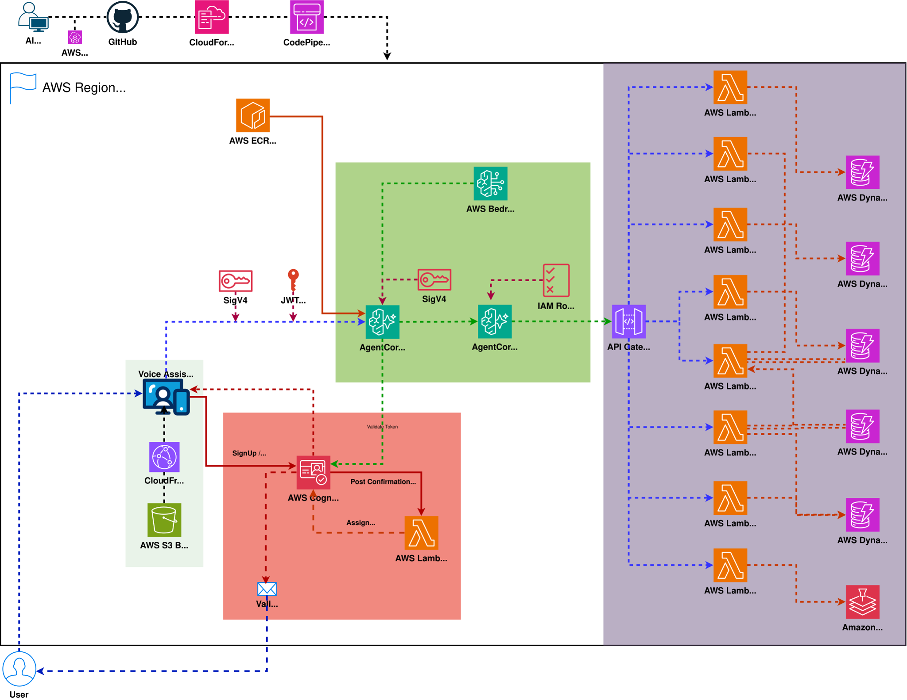

This project demonstrates a fully functional, highly conversational **Omnichannel Voice Ordering Assistant** for a Quick Service Restaurant (QSR) chain. This means the exact same AI backend can be seamlessly deployed across a web app, a mobile app, an in-store kiosk, or a Drive-Thru speaker, maintaining a unified customer state everywhere. Powered by **Amazon Nova Sonic v2**, **Amazon Bedrock AgentCore**, and the **MCP Protocol**, the assistant engages customers in natural, real-time voice conversations to take orders, upsell items, and locate the nearest branches using AWS Location Services.

---

## 🎥 Watch It In Action

Want to see the entire platform in action? Watch the quick demo:

[](https://youtu.be/SagiW7cQ8xA)

**Click to watch:** Real-time data flow, ML predictions, web dashboard & AI chatbot in 2 minutes

---

## 📦 What Business Problem Does This Solve?

Traditional QSR ordering experiences (Drive-Thru speakers, mobile apps, and in-store kiosks) are often frictionless but highly impersonal. They lack the ability to intelligently upsell, remember past customer preferences, or dynamically adjust to the customer's real-time physical context.

**This AI Assistant acts as a hyper-personalized "Digital Cashier".**
Instead of tapping through a screen, the customer simply speaks naturally. The assistant knows who the customer is, remembers their past orders, knows exactly where they are physically located, and seamlessly orchestrates the entire checkout process.

If a customer says:
> *"I'm starving. I'll just have my usual order from yesterday, but add a large fries."*

The AI instantly uses its backend tools to look up the customer's order history, fetches the current menu prices, calculates the tax based on the nearest store's location, adds the items to the cart, and responds in less than a second via highly realistic voice.

---

## 🌟 Deep Dive: Enterprise Architecture & IT Solutions

Deploying real-time speech-to-speech AI in a production environment introduces massive IT hurdles. This architecture solves the most critical enterprise concerns:

**🛡️ 1. Dual-Layer Security (Cognito JWT + SigV4)**
The system utilizes an Amazon Cognito User Pool to manage authentication. Instead of exposing secure backend APIs directly to a public browser, the frontend uses temporary IAM credentials to sign a WebSocket connection directly to the Bedrock AgentCore Runtime using **SigV4**. Simultaneously, the `AuthInterceptor` validates the **Cognito JWT** inside the WebSocket stream. A specialized **Post-Confirmation Lambda** automatically assigns a unique `customerId` upon email verification, strictly decoupling Cognito from the DynamoDB tables.
<br>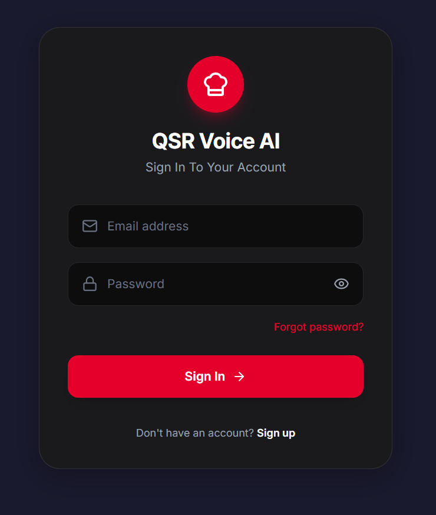
<br>

**🔗 2. Zero-Code Legacy Integration (OpenAPI & MCP Gateway)**
Custom Python/Node.js "tools" for the AI do not need to be written. The AgentCore Gateway automatically ingests standard OpenAPI schemas directly from the API Gateway. This means this AI Agent can be dropped on top of **any existing backend REST API** (even legacy systems), and the AI will dynamically discover and use endpoints as tools via the Model Context Protocol (MCP).

**🧠 3. Stateless AI (No Vector DB or Memory Sync Issues)**
Maintaining user "memory" usually requires expensive Vector Databases or injecting massive chat histories into the LLM context. This AI is entirely **stateless**. When it needs to remember past orders or preferences, it uses tools to query the production DynamoDB in real-time. This guarantees 100% accuracy, eliminates hallucinations, and drastically reduces token costs.

**⚡ 4. Ultra-Low Latency Speech-to-Speech**
Using the new **Amazon Nova Sonic v2**, the system bypasses the traditional "Speech-to-Text -> LLM -> Text-to-Speech" pipeline. It understands and generates audio directly, resulting in ultra-low latency, human-like conversations that capture tone and emotion.

**📈 5. Infinite Scalability & Zero Idle Costs (100% Serverless)**
Built on a pure **Serverless Architecture** (AgentCore, API Gateway, Lambda, DynamoDB ). Whether you have 10 or 10,000 customers ordering simultaneously, it scales automatically. Even the Next.js frontend is serverlessly hosted on **Amazon S3 & CloudFront** (secured via OAC). When the system is idle (e.g., stores are closed), compute costs drop to exactly zero.

**📊 6. Full Observability & Auditability**
Enterprise systems require strict auditing. AgentCore is fully integrated with AWS CloudWatch (accessible via GenAI Observability > Bedrock AgentCore). Every tool the AI calls, every database response it reads, and its internal "Chain of Thought" reasoning are logged. Administrators can trace exactly *why* and *how* the AI reached its conclusions.
<br>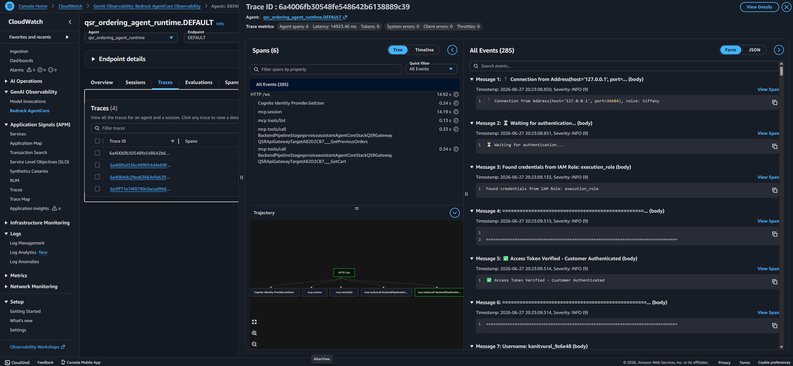

---

## 🛠️ AWS Architecture & Services Used

This project implements a fully managed, scalable, and secure architecture utilizing the following core AWS services:

* **Amazon Bedrock (Nova Sonic v2):** The core AI model natively handling direct speech-to-speech interaction with ultra-low latency.
* **Amazon Bedrock AgentCore:** Hosts the WebSocket Gateway and Runtime container, automatically orchestrating MCP tools and SigV4 authentication. Powered by the cutting-edge **AWS Strands Framework (`strands.experimental.bidi`)** to enable true bidirectional (Bidi) audio streaming over WebSockets.
* **AWS Lambda & API Gateway:** Serverless compute layer executing business logic (AddToCart, PlaceOrder, GeocodeAddress, etc.).
* **Amazon DynamoDB:** A highly scalable NoSQL database hosting 5 tables (`Customers`, `Locations`, `Menu`, `Orders`, `Carts`).
* **Amazon Cognito:** Secures the web UI by handling user authentication, authorization, and secure JWT token management.
* **AWS Location Service (Geo Places):** Provides routing, geocoding, and nearest-location calculations.
* **Amazon S3 & CloudFront:** Hosts the React/Next.js frontend application.
* **AWS CodePipeline & CodeBuild:** Provides a fully automated CI/CD pipeline that seamlessly deploys frontend and backend updates.
* **AWS CDK (Cloud Development Kit):** Defines the entire infrastructure as code in Python, ensuring reproducible deployments.

---

## 🧱 Infrastructure as Code (CDK) Stacks

The project consists of multiple CDK stacks deployed via AWS CodePipeline:

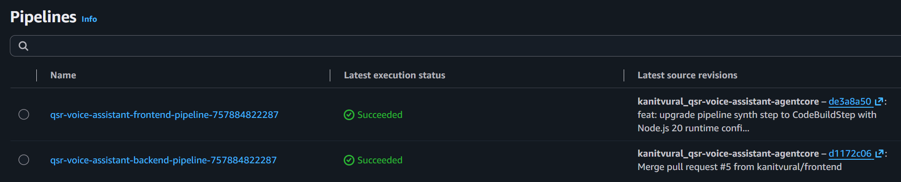
<br>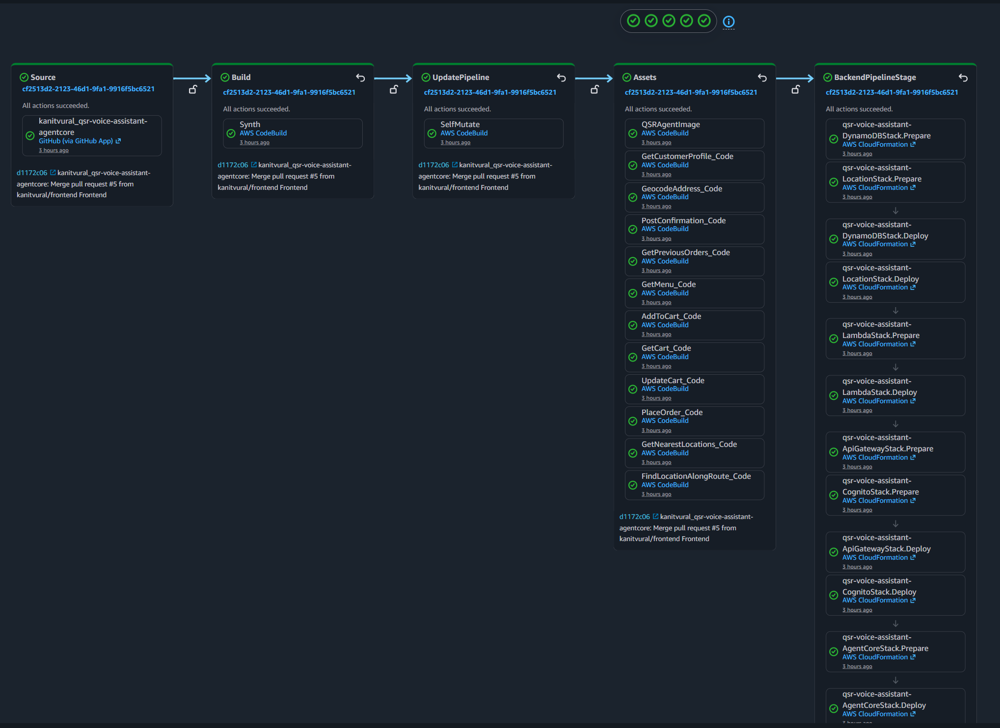
<br>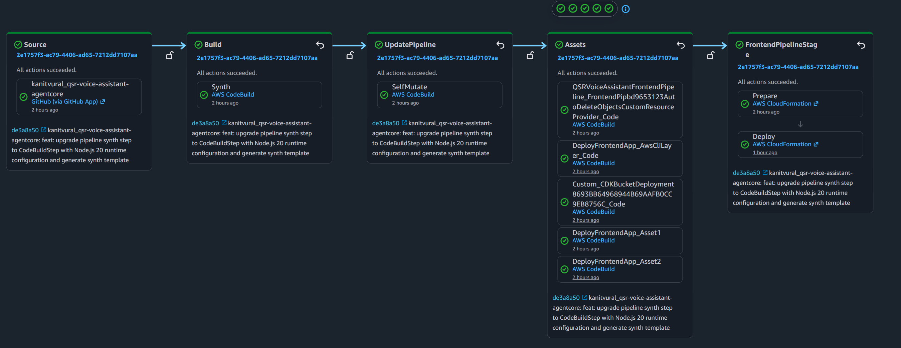

1. **AgentCoreStack**: Hosts the AgentCore Gateway, the Bidi Agent Runtime, and orchestrates the WebSocket layer.
2. **ApiGatewayStack**: Exposes REST APIs for all backend business logic.
3. **CognitoStack**: User Pool and Identity Pool for authenticating users and granting temporary AWS credentials.
4. **LambdaStack**: Multiple AWS Lambda functions handling domain-specific tool execution.
5. **LocationStack**: Configures AWS Location Service (Geo Places) for spatial queries.
6. **DynamoDBStack**: Defines the schema and provisions the 5 core tables.
7. **S3CloudfrontStack**: Secure frontend delivery using S3 and CloudFront with OAC.

---

## 📂 Project Structure Overview

```text
📦 qsr-voice-assistant-agentcore/
├── 📁 backend/                # Serverless Backend & AgentCore
│   ├── 📁 agent_core/         # Bedrock AgentCore WebSocket Runtime & MCP config
│   ├── 📁 cdk_pipeline/       # Backend CI/CD CodePipeline definition
│   ├── 📁 lambda_funcs/       # Serverless Tool Handlers (Menu, Cart, Location)
│   ├── 📁 scripts/            # Backend utility scripts
│   └── 📁 stacks/             # Backend AWS CDK Infrastructure definitions
├── 📁 frontend/               # Next.js Frontend Application
│   ├── 📁 cdk_pipeline/       # Frontend CI/CD CodePipeline definition
│   ├── 📁 qsr-app/            # Next.js Source Code
│   ├── 📁 scripts/            # Synthetic Data Seeding & Config Generators
│   └── 📁 stacks/             # Frontend AWS CDK Infrastructure definitions
├── 📄 app.py                  # CDK app entry point
├── 📄 cdk.json                # CDK configuration
├── 📄 Makefile                # Deployment commands
└── 📄 README.md               # Documentation
```

---

## 🔄 User Request Flow (Under the Hood)

The entire architecture is built on a highly secure, real-time streaming pipeline:

1. The user accesses the web application hosted on **Amazon S3 & CloudFront** from their browser or mobile device.
2. The user authenticates with **Amazon Cognito** using their username and password and receives JWT tokens (Access Token and ID Token).
3. The frontend exchanges the ID Token with the Cognito Identity Pool for temporary AWS credentials (Access Key, Secret Key, Session Token).
4. The frontend establishes a secure, **SigV4-signed WebSocket connection** (The outer transport security) to the **AgentCore Runtime**, and immediately injects the **Cognito JWT Access Token** (The identity payload) as the first frame. This dual-layer security ensures both AWS infrastructure authorization and application-level customer identity.
5. The agent hosted in AgentCore Runtime validates the Access Token by calling the Cognito GetUser API and extracts the customer's verified name, email, and `customerId`.
6. AgentCore Runtime initializes the **Nova 2 Sonic** model on Amazon Bedrock and builds a personalized system prompt with the verified customer context.
7. AgentCore Runtime connects to **AgentCore Gateway** as an **MCP (Model Context Protocol) client** using SigV4 authentication and discovers the available tools.
8. The user speaks their order. The agent processes the voice input through Nova 2 Sonic and invokes tools asynchronously through the AgentCore Gateway using MCP.
9. AgentCore Gateway exposes the backend REST APIs as MCP tools. When the agent calls a tool, AgentCore Gateway forwards the request as a REST API call to the **API Gateway**, which routes it to the appropriate **Lambda function**.
10. The Lambda functions query **DynamoDB** tables and **AWS Location Services** and return the response to the Gateway.
11. Nova 2 Sonic generates a contextual voice response incorporating the tool results and streams it back to the user over the WebSocket connection.

---

## 📍 The Role of AWS Location Service (Location-Awareness)

A critical feature of this AI Assistant is its **Location-Awareness**. Since a QSR chain has hundreds of branches, the assistant needs to know exactly which branch to route the order to. AWS Location Service enables three incredible capabilities:

* **Geofencing (Drive-Thru vs. In-Store):** If the customer opens the app while sitting in their car in the drive-thru line, the system instantly detects they are 10 meters away from a specific branch. The AI automatically greets them with: *"I see you're at our Kadıköy branch! Should I send your order straight to the kitchen?"*
* **En Route / Pick-Up Calculation:** If the customer is driving, the AI can calculate a route and say: *"There is a branch right on your way to work, it's just a 2-minute detour. I'll send your coffee there so it's ready when you arrive."*
* **Dynamic Menu & Tax Calculation:** Different branches have different local taxes or menu availability. Finding the nearest branch ensures accurate pricing.

### 🧪 Synthetic Branch Generation (`seed_data.py`)
To make this demo incredibly realistic without requiring ownership of a real restaurant chain, a special **`seed_data.py`** script is included. 
When executed, the script prompts for a city and preferred restaurant type (e.g., "Burger"). It uses the **Amazon Geo Places API** to find *real* burger joints near that location and saves them into the DynamoDB `Locations` table to act as synthetic branches. This guarantees that during testing, the voice assistant will seamlessly find real-world streets and locations nearby.

---

## 🧠 Voice Assistant Agent System & Tools

Rather than relying on hardcoded tool definitions, this architecture introduces a highly dynamic and scalable **Agentic Workflow** using the Model Context Protocol (MCP) and Amazon API Gateway.

Instead of writing manual tool wrappers, the AgentCore Gateway automatically ingests the OpenAPI schemas directly from the API Gateway. The AI Agent seamlessly discovers these REST APIs and uses the entire serverless backend infrastructure as its toolset. When the AI needs real-world data, it triggers a specific AWS Lambda function via API Gateway to query or mutate state in DynamoDB:

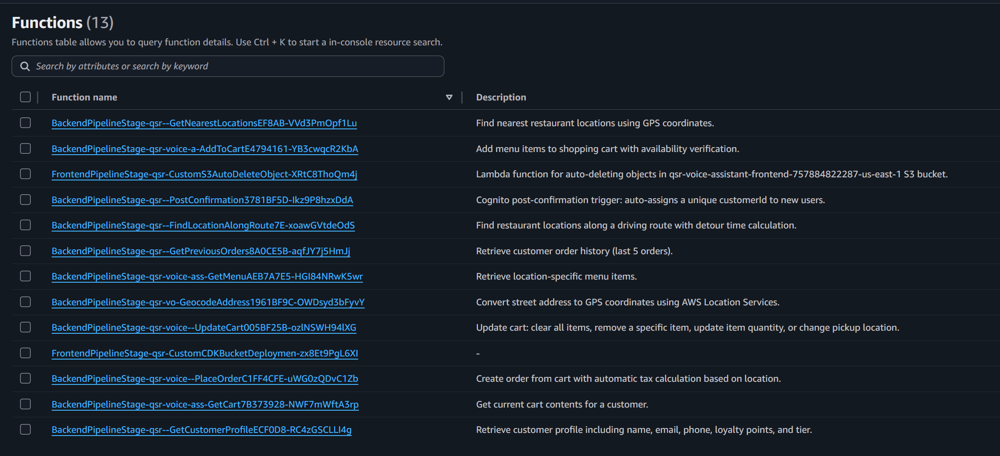

* **GetMenu Tool** ➡️ Queries `QSR-Menu` for current items and prices.
* **Location Tools** ➡️ `GeocodeAddress`, `GetNearestLocations`, `FindLocationAlongRoute` ➡️ Uses AWS Location Service and queries `QSR-Locations`.
* **Cart Tools** ➡️ `GetCart`, `AddToCart`, `UpdateCart` ➡️ Manages the temporary `QSR-Carts` state.
* **Order Tools** ➡️ `PlaceOrder`, `GetPreviousOrders` ➡️ Writes to and reads from `QSR-Orders`.
* **Customer Profile** ➡️ `GetCustomerProfile` ➡️ Retrieves loyalty data from `QSR-Customers`.

---

## 🗄️ DynamoDB Tables

The project deploys 5 DynamoDB tables that act as the single source of truth for the QSR chain:

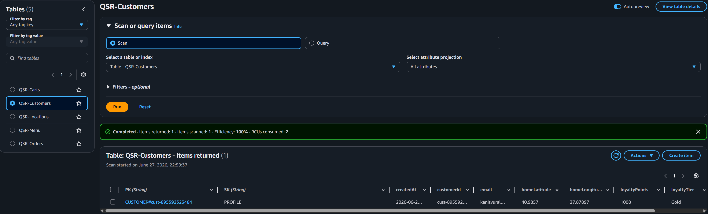
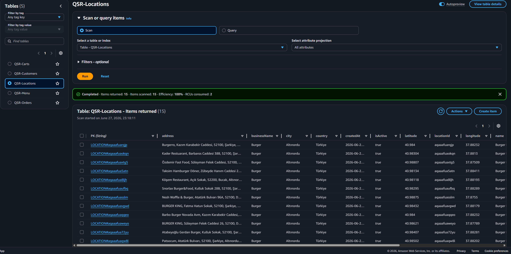
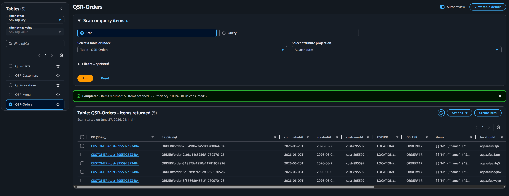

1. **`QSR-Locations`**: Stores the GPS coordinates, addresses, and IDs of the restaurant branches.
2. **`QSR-Menu`**: Stores available items, prices, and allowed customizations (e.g., "No Onions", "Extra Cheese").
3. **`QSR-Customers`**: Stores customer profiles, loyalty tiers, and home locations.
4. **`QSR-Carts`**: A temporary table holding active shopping carts before checkout.
5. **`QSR-Orders`**: The historical ledger of all completed orders.

---

## 💰 Enterprise Cost Estimation (Monthly)

This architecture is primarily **Serverless** (pay-per-use), making it highly cost-effective for both prototyping and production. 

**Assumptions & Scenario:**
- **Traffic:** 1,000 voice orders per day (~30,000 orders/month).
- **AI Models:** Amazon Nova Sonic v2 (Voice).
- **Storage:** S3 (Frontend assets), DynamoDB (Order/Menu data).

| AWS Service | Cost Factor & Estimation | Approx. Monthly Cost |
|-------------|-------------------------|----------------------:|
| **Amazon Bedrock (Nova Sonic v2)** | Pay-as-you-go per token and audio second. | **~$45.00** |
| **Amazon API Gateway** | 100,000 REST API calls ($1.20/1M). | **~$0.12** |
| **AWS Lambda** | 100,000 executions (well within free tier or pennies). | **~$0.50** |
| **Amazon DynamoDB** | On-Demand Read/Write (negligible for 30k orders). | **~$1.50** |
| **Amazon Cognito** | 1,000 MAU (Free tier covers 50k MAU). | **$0.00** |
| **Amazon CloudFront & S3** | Standard traffic for Voice UI frontend. | **~$2.00** |
| **Total Estimated Cost** | | **~$49.12** |

---

## 🚀 Deployment Instructions

Before deploying this project, ensure your local environment and AWS account meet the following requirements:

### 0. Prerequisites

**Local Environment:**
* **Node.js (v20+)**: Required for Next.js 15 and AWS CDK. ([Download Node.js](https://nodejs.org/))
* **AWS CLI (v2)**: Required to interact with your AWS account. ([Install AWS CLI](https://docs.aws.amazon.com/cli/latest/userguide/getting-started-install.html))
* **Python (3.11+)**: Required for the CDK deployment scripts and Lambda functions.
* **Git**: Required for version control and pulling the repository.
* **AWS CDK**: Install the AWS Cloud Development Kit globally by running `npm install -g aws-cdk` in your terminal.

**AWS Account Setup:**
* **IAM User/Role**: You must have an IAM User or Role with `AdministratorAccess` (or sufficient permissions to create IAM Roles, Lambda functions, Bedrock models, and DynamoDB tables).
* **AWS CLI Configuration**: Configure your local machine with your AWS credentials by running `aws configure` in your terminal and providing your Access Key ID and Secret Access Key.
* **Amazon Bedrock Model Access**: You **MUST** manually request access to the **Amazon Nova Sonic v2** model in the AWS Bedrock Console (us-east-1) before deploying, otherwise the voice assistant will fail.

### 1. Setup Your Environment
```bash
# Clone the repository
git clone https://github.com/kanitvural/qsr-voice-assistant-agentcore.git
cd qsr-voice-assistant-agentcore

# Create virtual environment
python3 -m venv .venv  # Use 'python -m venv .venv' on Windows

# Activate on Mac/Linux:
source .venv/bin/activate

# Activate on Windows (Command Prompt):
.venv\Scripts\activate

# Install dependencies
pip install -r requirements.txt
npm install -g aws-cdk
```

### 2. Configure AWS CodeStar Connection for GitHub
The pipeline pulls the source code directly from GitHub. You must configure an AWS CodeStar Connection:
1. Go to the **AWS Console** -> **Developer Tools** -> **Settings** -> **Connections**.
2. Click **Create connection**, select **GitHub**, and follow the prompts to authorize the AWS Connector for GitHub.
3. Make sure to grant access to **your repository** (e.g., `<your-repo-name>`).
4. Copy the newly created **Connection ARN**.
5. Open `cdk.json` in the root of the project. Inside the `"context"` JSON block, update the following properties to match your setup:
   ```json
   "context": {
     "githubConnectionArn": "arn:aws:codeconnections:eu-central-1:123456789012:connection/...",
     "githubRepo": "<your-username>/<your-repo-name>",
     "githubBranch": "main"
   }
   ```

### 3. Deploy the Infrastructure (Zero-Touch Deployment)
The system uses AWS CDK self-mutating pipelines. Deploy the backend and frontend stacks:
```bash

make bootstrap env=backend
make deploy env=backend

make bootstrap env=frontend
make deploy env=frontend
```

### 4. Get the Live App URL
Once the frontend pipeline finishes, you can easily fetch the live application URL by running:
```bash
python frontend/scripts/get_cloudfront_url.py
```
### 5. Create a User Account
Before logging into the frontend, you must register a new user in the Amazon Cognito User Pool. You can do this by navigating to the live application URL (CloudFront) and clicking on the **Sign Up** button, or by creating a user directly via the AWS Cognito Console. Ensure you use the same email address that you provided during the `seed_data.py` step to link your synthetic order history to your profile.

### 6. Generate Synthetic Data
Once the deployment finishes, populate your DynamoDB tables with real-world locations near you:
```bash
python frontend/scripts/seed_data.py
```
*(The script will ask for your email to tie the test data to your Cognito account, and will use AWS Geo Places to find real locations near your address).*

---

## 🎯 Test the AI Assistant (Example Scenarios)

Once the data is seeded, open the frontend web application (CloudFront URL), log in, click the Microphone button, and try speaking these scenarios to test the various backend tools and DynamoDB tables:

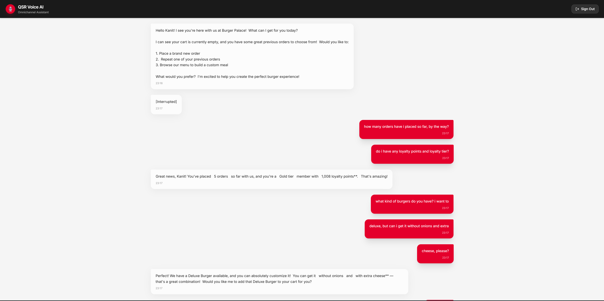

**🧑‍💻 1. Customer Profile (`QSR-Customers`) & Past Orders (`QSR-Orders`)**
> *"How many orders have I placed so far? By the way, do I have any loyalty points and loyalty tier?"*
*(The AI will query DynamoDB for your past orders, count them, and check your profile for your loyalty points and tier).*

**🍔 2. Menu Prices & Customizations (`QSR-Menu`)**
> *"What kind of burgers do you have? I want the Deluxe, but can I get it without onions and add extra cheese?"*
*(The AI will fetch the menu from DynamoDB, verify that 'No Onions' is a valid customization, and confirm the total price).*

**🛒 3. Cart Management (`QSR-Carts`)**
> *"Add that Deluxe Burger to my cart, and a large fries. Actually, make that two large fries."*
*(The AI uses the API Gateway tools to create a cart session and update your items in DynamoDB dynamically).*

**📍 4. Location Awareness & Routing (`QSR-Locations`)**
> *"I'm driving right now, where is your nearest branch? Can you send my order there?"*
*(The AI will detect your GPS location, find the closest branch using AWS Location Service, and route the final order).*

---

## 🗑️ Destroying the Infrastructure

To completely remove the project and stop all billing, you can manually delete the resources from the AWS Console.

1. Go to the **AWS CloudFormation Console**.
2. Delete all `Frontend-*` and `Backend-*` application stacks.
3. Empty the S3 Buckets automatically (Pipeline artifacts and CDK Toolkit).
4. Destroy the CDK Pipeline and Bootstrap stacks.

> ⚠️ **WARNING:**
If it fails to delete any stack, click Delete one more time and check the **Retain Resources** (Force Delete) option for the problematic resources. This will successfully delete the stack.
